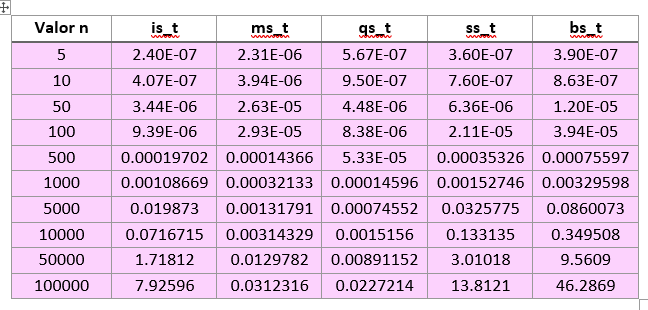
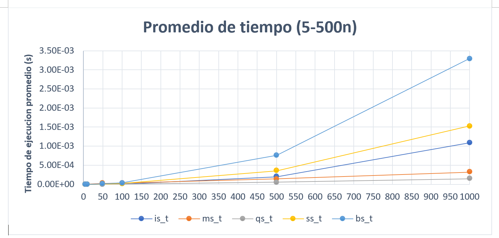
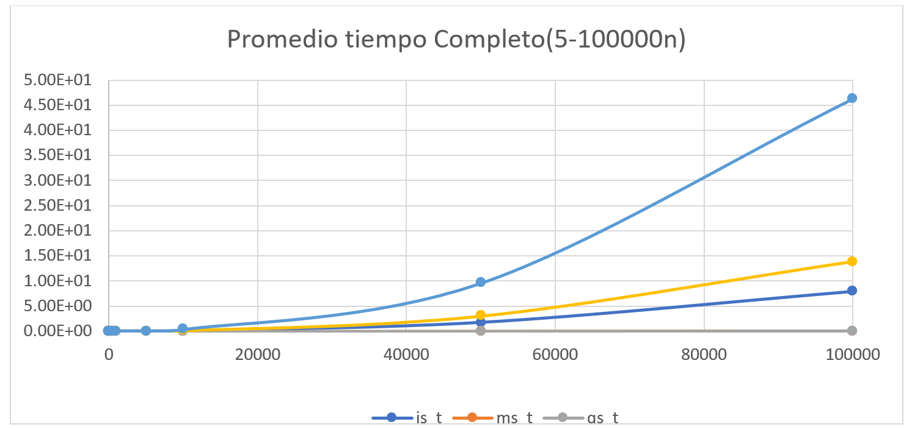
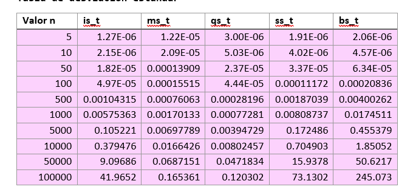
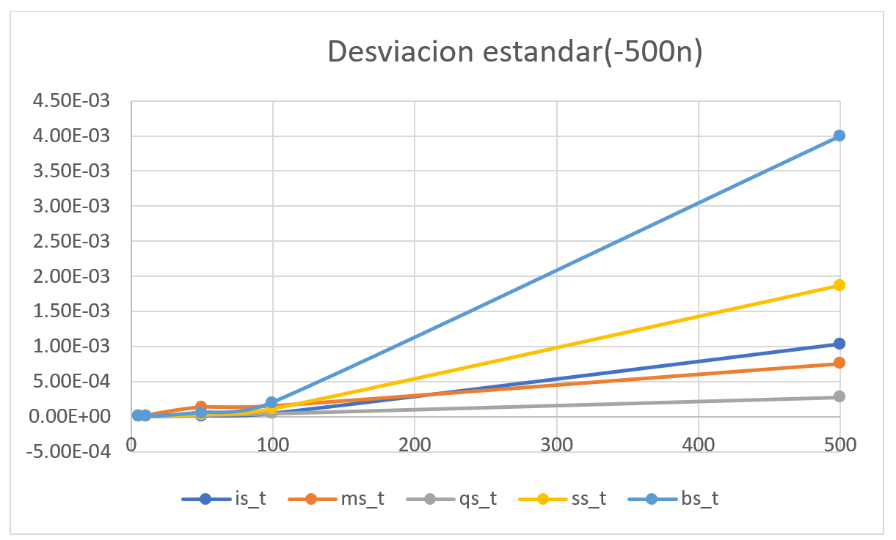
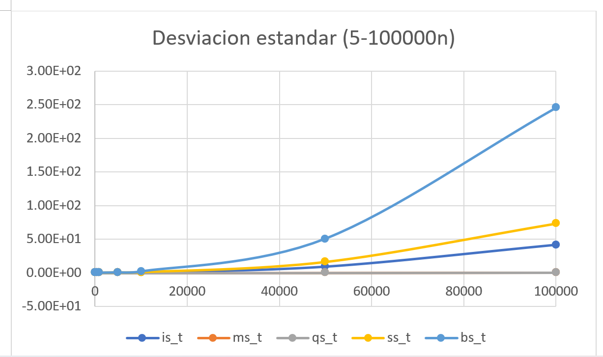

# Práctica 4: Algoritmos de ordenamiento

## Anaid Olguin Rico  30/01/2024

El problema de ordenamiento consiste en organizar una secuencia de elementos en un orden especifico, en esta práctica se analizaron los cinco algoritmos vistos en clase: insertion sort, selection sort, bubblesort, merge sort y Quicksort, analizando el rendimiento de estos algoritmos por su tiempo de ejecución. 

Para llevar a cabo la evaluación, se implemento un programa de control llamado ordenamiento.h, este programa recibe el tamaño del arreglo y el número de arreglos a generar, que para una mayor estabilidad en los resultados se utilizó el número de arreglos a generar y ordenar m= 30.

Este mismo programa nos permite calcular el promedio y la desviación estándar del tiempo de ejecución como podemos observar en las tablas siguientes, solo se tomaron valores de n hasta 100000, ya que con los otros valores el tiempo de espera fue mucho mayor.

***Tabla de valores promedio de ejecución.***

Se graficaron en dos partes los datos para un mejor análisis, y para ver desde los valores más pequeños el cambio en la gráfica. la primera grafica con valores de n de 5 hasta 500 y la segunda con todos los valores obtenidos en la ejecución. 

 

Estos datos representan el tiempo de ejecución en segundos de los algoritmos de ordenamiento para diferentes tamaños de arreglos que van desde 5 hasta 10^5.

 Para tamaños pequeños de arreglos, todos los algoritmos tienen tiempos de ejecución bajos y similares, conforme aumenta el tamaño de los arreglos los algoritmos *merge sort y quick sort* tienden a tener tiempos de ejecución más bajos a comparación de *insertion sort, selection sort y bubblesort*. Como ya se habia mencionado *insertion sort, selection sort y bubblesort* tienden a un tiempo de ejecución de orden cuadrático, mientras que *merge sort y quick sort* tienden a n lg n lo que les permite manejar arreglos más grandes de manera más eficiente. Por lo que son los de mejor eficiencia para arreglos mas grandes, debido a sus bajos tiempos de ejecución en comparación a los otros tres.

***Tabla de desviación estándar.***

La desviación estándar proporciona una medida de los tiempos de ejecución con sus promedios de tiempo, Valores más altos indican una mayor variabilidad en los datos. Se observa que de igual manera los algoritmos mege sort y quick sort tienen desviaciones estándar más bajas en comparación a las tres restantes, esto los hace más consistentes y tienen menor variabilidad entre ejecuciones
 

Se procedió a graficar los resultados arrojados por nuestro programa comparando los 5 algoritmos entre ellos arrojando asi los siguientes resultados.

## Conclusiones 
* Los resultados experimentales confirman las diferencias de eficiencia entre los algoritmos de ordenamiento estudiados. Los algoritmos de complejidad n log n (*merge sort y quicksort*) tienden a mostrar tiempos de ejecución más bajos en comparación con los algoritmos n^2(*insertion sort, selection sort, bubblesort*), especialmente para arreglos de mayor tamaño.
* Se observa que los algoritmos de complejidad n log n tienden a tener desviaciones estándar más bajas, lo que indica una mayor consistencia en sus tiempos de ejecucion, incluso al aumento del tamañoo del arreglo.
* El tamaño del arreglo influye directamente con su tiempo de ejecucion,  ya que en los algoritmos con complejidad n^2 cada elemento debe compararse y moverse,, lo que lleva a un mayor numero de opercaciones, mientras que los algoritmos con complejidad n log n tienen un rendimiento mas eficiente, con la division y combinacion de los elementos. 

